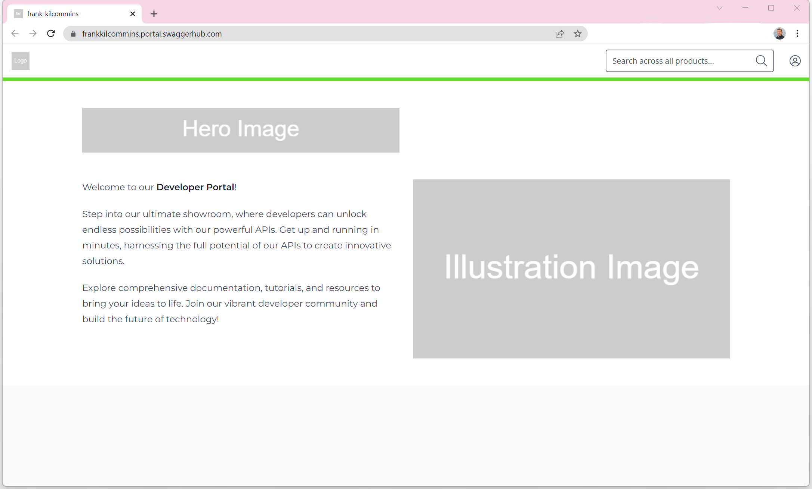

# SwaggerHub-Portal-Management

This ReadMe demonstrates how to configure and manage a SwaggerHub Portal instance directly via its administrative APIs. 

## Prerequisites
 - A software as a service (SaaS) enterprise plan with SwaggerHub. If required, obtain a trial license from https://try.smartbear.com/.
 - A `designer` or `owner` role within the SwaggerHub organization.
 - SwaggerHub Portal enabled for the SwaggerHub organization (from above).

 ## Base Info
 
 Base URL Endpoint: The SwaggerHub Portal API base endpoint is `https://api.portal.swaggerhub.com/v1`.
 Security: Authenticated requests must provide a SwaggerHub API key via the HTTP Authorization header.


 ## Use Cases

 The following use cases are covered:
 1. Manage Portal Settings (appearance, logos, fonts, etc.)
 2. Create and publish new Product
 3. Manage existing 
 4. Harden the Portal API OpenAPI document

### File structure

- images - all images for the portal configuration
- manifest - contains metadata for the portal settings
- products - contains all products to be configured
  - product_1 - contains all data relevant to Product1
    - *.md files - contains the markdown documents to be published
    - images folder - all images relevant to the Product (or referenced from the md files)
    - manifest - links to the APIs that will be added to the Product 1
  - product_2 ...
  - product_N


## Use Case 1 - Manage Portal Settings

The following section describes how to configure a portal instance via its administrative APIs.

The portal settings mainly control the branding, name, domain url, and availability of a portal. These settings are split into three levels: `general`, `branding`, and `landingPage`.

The following table outlines the settings per level
| Level      | Setting Name | Description |
| ----------- | ----------- | ----------- |
| root | `name` | The name of the portal instance |
| root | `subdomain` | The subdomain name to be prefixed onto the portal domain: `https://<SUBDOMAIN>.portal.swaggerhub.com/` |
| root | `offline` | Determines if the portal is offline and inaccessible to customers |
| branding | `faviconId` | A reference to the favicon attachment. *Note*  A _favicon_ must be 16x16 pixels, have a `.ico`, `.gif`, or `.png` file format, and be less than 5MB in size. |
| branding | `logoId` | A reference to the logo attachment. *Note*  A _logo_ must be 64x64 pixels, have a `.jpg`, `.gif`, or `.png` file format, and be less than 5MB in size. |
| branding | `fontName` | The font to use for the portal landing page and for all product pages. Support fonts are `Open Sans`, `Montserrat`, `Roboto`, `Playfair Display`, `Lato`, or `Merriweather`. |
| branding | `accentColor` | A hexidecimal color value to use for the accent color of the landing page and all product pages.
| landingPage | `heroImageId` | A reference to the hero image attachment. *Note*  A _hero_ image can be up to 566 x 80 pixels, have a `.jpg`, or `.png` file format, and be less than 5MB in size. |
| landingPage | `illustrationImageId` | A reference to the illustration image attachment. *Note*  An _illustration_ image should be at least 566 x 320 pixels, with a 16:9 aspect ratio, have a `.jpg`, or `.png` file format, and be less than 5MB in size. |
| landingPage | `pageDescription` | A short description for the portal landing page (upto 500 characters long). Markdown format supported.

### Retrieve the base information of your portal

To obtain the basic information on your portal instance, you should send a request to `https://api.portal.swaggerhub.com/v1/organizations?subdomain=<YOUR-CONFIGURED-DOMAIN>`

Sample cURL request:
```
curl --location 'https://api.portal.swaggerhub.com/v1/portals' \
--header 'Authorization: Bearer <YOUR-SWAGGERHUB-APIKEY>'
```

> Keep the response to hand as you'll use some of the data to update the portal-settings.json file as well as make addition API calls.

### Upload branding and landing images
The `logo`, `hero`, `illustration`, and `favicon` files can be uploaded via  `POST` requests to the `/attachments/branding/{portalId}?name={imageName}` endpoint.

> Don't forget to replace the placeholders in the sample request with real values
Sample cURL request:
```
curl -X POST -H "Content-Type: image/png" --data-binary "@fav.png" https://api.portal.swaggerhub.com/v1/attachments/branding/<YOUR-PORTALID>?name=<IMAGE-NAME> \
--header 'Authorization: Bearer <YOUR-SWAGGERHUB-APIKEY>'
```
> Keep the response to hand as you'll use some of the data to update the portal settings shortly


### Update the Portal Settings

Portal settings can be updated via a `PATCH` request to the `/portals/{portalId}` endpoint.

Below is a sample _request body_ which can be supplied with the request. The details on the properties can be found in the settings table above or via the [API docs](LINK TO DO). 

> don't forget to replace the placeholder values with the real values you obtained from the previous API calls
```
{
  "name": "<The Portal Name>",
  "subdomain": "<The subdomain for the Portal>",
  "offline": false,
  "landingPage": {
    "heroImageId": "<The id of the hero image attachment>",
    "illustrationImageId": "<The id of the illustration image attachment>",
    "pageDescription": "<A description of what the portal is for you customers (max 500 characters)>"
  },
  "branding": {
    "faviconId": "<The id of the favicon attachment>",
    "logoId": "<The id of the logo attachment>",
    "fontName": "<The fontname to use for portal>",
    "accentColor": "<The hexidecimal value for the accent color>"
  }
}
```

Sample cURL request:
```
curl --location --request PATCH 'https://api.portal.swaggerhub.com/v1/portals/<YOUR-PORTALID>' \
--header 'Authorization: Bearer <YOUR-SWAGGERHUB-APIKEY>' \
--header 'Content-Type: application/json' \

--data '{
    "name": "frank-kilcommins",
    "subdomain": "frankkilcommins",
    "offline": false,
    "landingPage": {
        "heroImageId": "42a69117-fc45-4cdd-b9be-a9bdb3779e48",
        "illustrationImageId": "0d4f20a1-d38d-433d-8272-38453bbcb45e",
        "pageDescription": "Welcome to our Developer Portal! Step into our ultimate showroom, where developers can unlock endless possibilities with our powerful APIs. Get up and running in minutes, harnessing the full potential of our APIs to create innovative solutions. Explore comprehensive documentation, tutorials, and resources to bring your ideas to life. Join our vibrant developer community and build the future of technology!"
    },
    "branding": {
        "faviconId": "a9d27f24-e62e-4198-9134-b948021c87e8",
        "logoId": "588a52ae-5526-436d-8aeb-65ee55ef09c4",
        "fontName": "Montserrat",
        "accentColor": "#63DB2A"
    }
}'
```

After updating the portal settings via the above PATCH request, the published portal now looks as follows:



