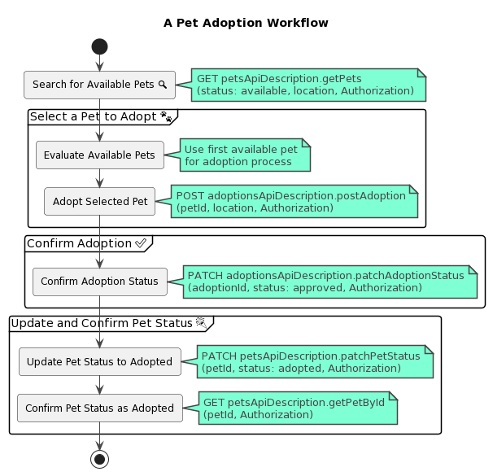
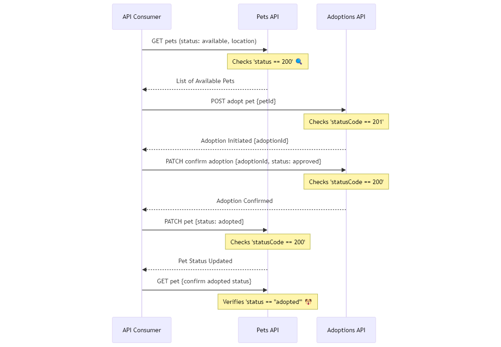

# Getting Started with the Pet Adoptions API Workflow

This **pet adoption** workflow provides a comprehensive process to `search `for, `select`, and `adopt `a pet. Utilizing two APIs, it starts by searching for available pets based on location, then moves to adopt a selected pet, confirm the adoption, update the pet's status to adopted, and finally confirm the pet's status update. The workflow is designed to be both developer and user-friendly, providing clear steps and expected outcomes. 

Following this workflow will greatly reduce your meantime to integration 🚀

## Arazzo Workflow Metadata
Here's some useful metadata about the supported workflow:
| Metadata           | Value                                                                     |
|--------------------|---------------------------------------------------------------------------|
| Specification      | 1.0.0                                                         |
| Title              | A pet adoptions workflow                                                   |
| Summary            | Showcases how to search for and adopt a pet through a sequence of API calls |
| Description        | Guides through searching for, selecting, and adopting an available pet.  |
| Version            | 1.0.0                                                                     |
| Source Descriptions| 2 (petsApiDescription, adoptionsApiDescription)                           |

## Workflow: A Pet Purchasing Workflow

### Summary

This workflow guides you through the process of searching for and adopting a pet, covering pet selection, adoption initiation, adoption updating, adoption and pet confirmation checks.

### Step Overview

Here's a breakdown of the steps you'll carry out to integrate this capability into your application:
| # | Step ID               | Description                                     | Operation ID                                        | Parameters                | Success Criteria                   | Outputs                         |
| ----|-----------------------|-------------------------------------------------|-----------------------------------------------------|---------------------------|------------------------------------|---------------------------------|
|1️⃣ | getPetStep            | Retrieve a pet by status                        | `petsApiDescription.getPets`                          | status, location, token   | `$statusCode == 200  `               | availablePets                   |
|2️⃣ | adoptPetStep          | Adopt a pet                                     | `adoptionsApiDescription.postAdoption`                | petId, token              | `$statusCode == 201`                 | adoptionId                      |
| 3️⃣ | confirmAdoptionStep   | Confirm the adoption by updating the status     | `adoptionsApiDescription.patchAdoptionStatus `        | adoptionId, token         | `$statusCode == 200`                 | N/A                             |
| 4️⃣ | updatePetStep         | Update the pet status to `adopted`              | `petsApiDescription.patchPetStatus `                  | petId, token              | `$statusCode == 200  `               | N/A                             |
| 5️⃣ | confirmPetStatusStep  | Confirm the pet status update to `adopted`      | `petsApiDescription.getPetById`                       | petId, token              | `$statusCode == 200`, `adopted `status | adoptedPetName, adoptedPetStatus, adoptedPetId, adoptedPetLocation |

### Graphical Representation of Workflow Steps

 

### Developer Integration Guidance

Developers integrating this workflow should note:

* Authentication is crucial at each step, requiring a valid token.
* The sequence of steps must be followed precisely for successful execution.
* Proper error handling should be implemented to handle unsuccessful API calls or unmet success criteria.
* Developers must ensure the correct mapping and passing of parameters between steps, especially for dynamically derived values like `petId`.

### Client Code Samples

- [csharp](./client-code-csharp)
- [typescript](./client-code-typescript)