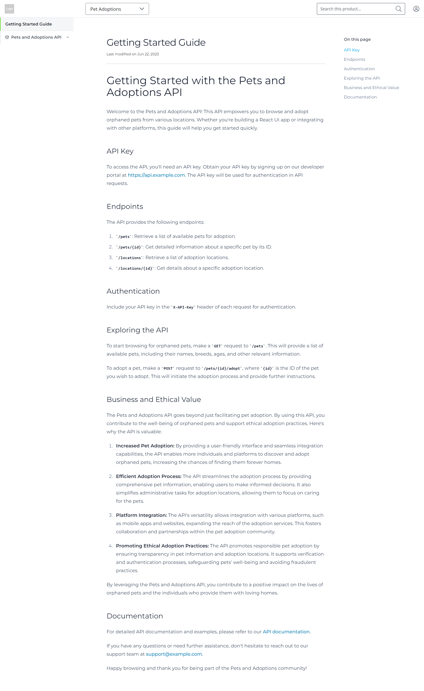
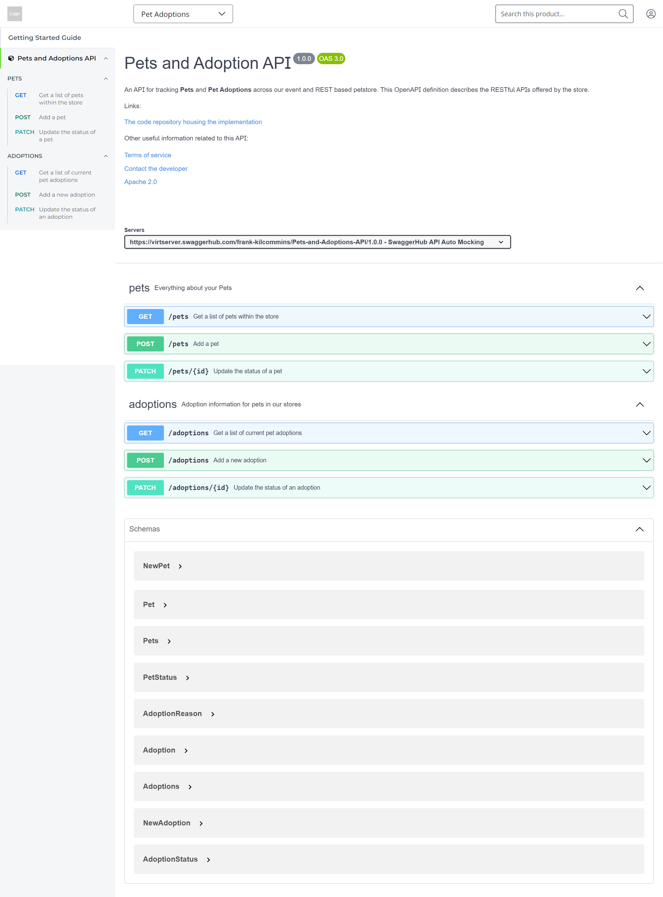

Once a product has been created, it can be enriched with the technical API reference documents (e.g. an OpenAPI document or AsyncAPI document) and additional Markdown documents to further explain for consumers how to get up and running with the product.

The SwaggerHub Portal APIs can be leveraged to automate the creation of API references and additional documentation material which can enhance the developer experience (DX) of published products.

The following API resources and paths are leveraged:

* `/sections`
* `/sections/{sectionId}/table-of-contents`
* `/documents/{documentId}`

Within the portal, API reference material and documentation are grouped under a resource known as **sections**. 

## Add Section
Prior to adding API references or supporting documentation, you must create a _section_ to house the content. 

A section can be created via a `POST` request to the [`/sections`](https://frankkilcommins.portal.swaggerhub.com/swaggerhub-portal/default/swaggerhub-portal-api#/Content-Sections/createSection) resource endpoint.

Sample cURL request to create a section:

```
curl --location --request POST 'https://api.portal.swaggerhub.com/v1/sections' \
--header 'Authorization: Bearer <YOUR-SWAGGERHUB-APIKEY>' \
--header 'Content-Type: application/json' \

--data '
{
    "productId": "<The productId from previous step>",
    "title": "Petstore Adoptions API",
    "slug": "petstore-adoptions",
    "order": 1
}
```

Sample response payload:

```
{
  "id": "5234107e-f789-4540-87b1-53a566f47163"
}
```

> **Note:** keep note of the returned `id` for the section, as it will be needed for later API calls to add API references and documentation.

## Add API Reference

API reference documents (e.g., an OpenAPI definition) exist as **table-of-contents** resources within a product section. An API reference document can be added to a product via a `POST` request to the [`/sections/{sectionId}/table-of-contents`](https://frankkilcommins.portal.swaggerhub.com/swaggerhub-portal/default/swaggerhub-portal-api#/Content-Table-of-Contents/createTableOfContentsEntry) resource endpoint.

> **Note:** currently only SwaggerHub hosted API references can be linked to portal products. Please have the published URL of your SwaggerHub API ready when preparing the API request below!

A sample cURL request to add an API reference:

```
curl --location --request POST 'https://api.portal.swaggerhub.com/v1/sections/<SECTION-ID>/table-of-contents' \
--header 'Authorization: Bearer <YOUR-SWAGGERHUB-APIKEY>' \
--header 'Content-Type: application/json' \

--data '{
  "slug": "pets-and-adoptions-api-1.0.0",
  "title": "Pets and Adoptions API",
  "order": 1,
  "content": {
    "type": "apiUrl",
    "url": "https://api.swaggerhub.com/apis/frank-kilcommins/Pets-and-Adoptions-API/1.0.0/swagger.json"
  } 
}'
```

Sample response body:

```
{
  "id": "4adfa584-c88f-49a8-b66e-7e90f3c20395"
}
```

## Add Documentation

Additional Markdown documentation can also be added to improve the understanding and consumption experience of products. Markdown documents also exist as **table-of-contents** resources within a product section. A Markdown document reference can be added to a product via a `POST` request to the [`/sections/{sectionId}/table-of-contents`](https://frankkilcommins.portal.swaggerhub.com/swaggerhub-portal/default/swaggerhub-portal-api#/Content-Table-of-Contents/createTableOfContentsEntry) resource endpoint.

The difference between a Markdown document and an API Reference document is described via the `content` object in the request payload. The `order` to control where the document will appear in the *table-of-contents*.

A sample cURL request to add a documentation reference:

```
curl --location --request POST 'https://api.portal.swaggerhub.com/v1/sections/<SECTION-ID>/table-of-contents' \
--header 'Authorization: Bearer <YOUR-SWAGGERHUB-APIKEY>' \
--header 'Content-Type: application/json' \

--data '{
  "slug": "getting-started",
  "title": "Getting Started Guide",
  "order": 0,
  "content": {
    "type": "markdown"
  } 
}'
```

Sample response body:

```
{
  "id": "0afe1039-e1a4-4bb3-9d13-a0e7c2a6942c",
  "documentId": "5af87df5-ff80-4423-a0a1-a1db5fb99cb7"
}
```

### Add Markdown contents

Now that the `documentId` of the *table-of-contents* resource for the markdown has been obtained, the content itself can be prepared. Markdown content can be added to the document via a `PATCH` request to the [`/documents/{documentId}`](https://frankkilcommins.portal.swaggerhub.com/swaggerhub-portal/default/swaggerhub-portal-api#/Content-Documents/patchDocument) resource endpoint.

A sample cURL request to update document content:

```
curl --location --request PATCH 'https://api.portal.swaggerhub.com/v1/documents/<DOCUMENT-ID>' \
--header 'Authorization: Bearer <YOUR-SWAGGERHUB-APIKEY>' \
--header 'Content-Type: application/json' \

--data '{
    "content": "# Getting Started with the Pets and Adoptions API\n\nWelcome to the Pets and Adoptions API! This API empowers you to browse and adopt orphaned pets from various locations. Whether you're building a React UI app or integrating with other platforms, this guide will help you get started quickly.\n\n## API Key\n\nTo access the API, you'll need an API key. Obtain your API key by signing up on our developer portal at [https://api.example.com](https://api.example.com). The API key will be used for authentication in API requests.\n\n## Endpoints\n\nThe API provides the following endpoints:\n\n1. `/pets`: Retrieve a list of available pets for adoption.\n2. `/pets/{id}`: Get detailed information about a specific pet by its ID.\n3. `/locations`: Retrieve a list of adoption locations.\n4. `/locations/{id}`: Get details about a specific adoption location.\n\n## Authentication\n\nInclude your API key in the `X-API-Key` header of each request for authentication.\n\n## Exploring the API\n\nTo start browsing for orphaned pets, make a `GET` request to `/pets`. This will provide a list of available pets, including their names, breeds, ages, and other relevant information.\n\nTo adopt a pet, make a `POST` request to `/pets/{id}/adopt`, where `{id}` is the ID of the pet you wish to adopt. This will initiate the adoption process and provide further instructions.\n\n## Business and Ethical Value\n\nThe Pets and Adoptions API goes beyond just facilitating pet adoption. By using this API, you contribute to the well-being of orphaned pets and support ethical adoption practices. Here's why the API is valuable:\n\n1. **Increased Pet Adoption:** By providing a user-friendly interface and seamless integration capabilities, the API enables more individuals and platforms to discover and adopt orphaned pets, increasing the chances of finding them forever homes.\n\n2. **Efficient Adoption Process:** The API streamlines the adoption process by providing comprehensive pet information, enabling users to make informed decisions. It also simplifies administrative tasks for adoption locations, allowing them to focus on caring for the pets.\n\n3. **Platform Integration:** The API's versatility allows integration with various platforms, such as mobile apps and websites, expanding the reach of the adoption services. This fosters collaboration and partnerships within the pet adoption community.\n\n4. **Promoting Ethical Adoption Practices:** The API promotes responsible pet adoption by ensuring transparency in pet information and adoption locations. It supports verification and authentication processes, safeguarding pets' well-being and avoiding fraudulent practices.\n\nBy leveraging the Pets and Adoptions API, you contribute to a positive impact on the lives of orphaned pets and the individuals who provide them with loving homes.\n\n## Documentation\n\nFor detailed API documentation and examples, please refer to our [API documentation](https://api.example.com/docs).\n\nIf you have any questions or need further assistance, don't hesitate to reach out to our support team at [support@example.com](mailto:support@example.com).\n\nHappy browsing and thank you for being part of the Pets and Adoptions community!"
}'
```

## Publish your content
The last step needed will be to publish the product documentation content, so that it appears on your live portal. Product content can be published via a `PUT` request to the [`/products/{productId}/published-content`](https://frankkilcommins.portal.swaggerhub.com/swaggerhub-portal/default/swaggerhub-portal-api#/Content-Publishing/publishContent) resource endpoint.

 🚧All API references and documentation added in the previous steps will be published as part of this call.

A sample cURL request to publish product content:
```cURL
curl --location --request PUT 'https://api.portal.swaggerhub.com/v1/products/<PRODUCT-ID>/table-of-contents' \
--header 'Authorization: Bearer <YOUR-SWAGGERHUB-APIKEY>' \
```

After publishing the documentation and API reference, the portal product documentation looks like follows:



