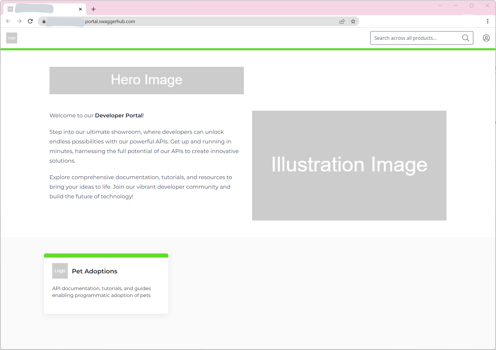

 The following section describes how to create and publish a new product (i.e. an API product) to a SwaggerHub Portal instance directly via its APIs.

A product, in terms of SwaggerHub Portal, is a combination of metadata (a.k.a. *product settings*), API reference documents (e.g., an [OpenAPI](https://swagger.io/resources/open-api/) document), and Markdown documents.

The following table outlines the settings per product

| Setting Name | Description |
| ------------ | ----------- |
| `name` | The name of the product that will appear on the portal landing page (maximum length is 22 characters). |
| `slug` | The URL segment to be appended to the portal URL to uniquely reference the product `https://<SUBDOMAIN>.portal.swaggerhub.com/<SLUG>`. |
| `description` | The product description that will appear on the landing page (maximum length is 110 characters). |
| `public` | Indicates whether or not the product is available publicly (i.e., to non-members of the SwaggerHub organization linked to the portal instance). Defaults to `false`. |
| `hidden` | Indicates whether or not the product will be displayed on the portal landing page. Defaults to `false` (so product is visible on landing page by default). |

## Create Product

This section describes how to create a product and set the main product settings.

A new product can be created via a `POST` request to the [`/products`](https://frankkilcommins.portal.swaggerhub.com/swaggerhub-portal/default/swaggerhub-portal-api#/Products/createProduct) endpoint. Below is a sample `cURL` request, which creates a product with the base settings populated, and sets the visibility to *private*.

> don't forget to replace the placeholder values with the real values

```
curl --location --request POST 'https://api.portal.swaggerhub.com/v1/products' \
--header 'Authorization: Bearer <YOUR-SWAGGERHUB-APIKEY>' \
--header 'Content-Type: application/json' \

--data '{
  "portalId": "<PORTAL-ID>",
  "name": "Pet Adoptions",
  "description": "API documentation, tutorials, and guides enabling programmatic adoption of pets",
  "slug": "pet-adoptions",
  "public": false,
  "hidden": false
}'
```

Sample response body:

```
{
  "id": "62a07233-3bbe-4008-b6aa-4f4e732352d5"
}
```

> **note** keep note of the returned `id` for the products, as it will be needed for later API calls

## Add Product Logo

Products can also have a *logo*. 

 🚧In the current version of the API, we do **not** support attachment uploading. The `logo` image file for the product must be uploaded via your portal user interface. 


After updating the product settings, the published portal now looks as follows:

