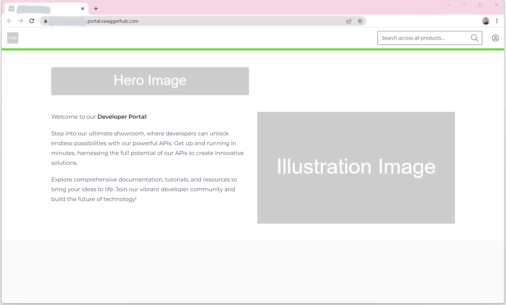

 The following section describes how to configure a portal instance via its administrative APIs.

The portal settings control the branding, name, domain url, and availability of a portal. These settings are split into three levels: `general`, `branding`, and `landingPage`.

The following table outlines the settings per level

| Level | Setting Name | Description |
| ----- | ------------ | ----------- |
| general | `name` | The name of the portal instance |
| general | `subdomain` | The subdomain name to be prefixed onto the portal domain: `https://<SUBDOMAIN>.portal.swaggerhub.com/` |
| general | `offline` | Determines if the portal is offline and inaccessible to customers |
| branding | `faviconId` | A reference to the favicon attachment. *Note* A *favicon* must be 16x16 pixels, have a `.ico`, `.gif`, or `.png` file format, and be less than 5MB in size. |
| branding | `logoId` | A reference to the logo attachment. *Note* A *logo* must be 64x64 pixels, have a `.jpg`, `.gif`, or `.png` file format, and be less than 5MB in size. |
| branding | `fontName` | The font to use for the portal landing page and for all product pages. Support fonts are `Open Sans`, `Montserrat`, `Roboto`, `Playfair Display`, `Lato`, or `Merriweather`. |
| branding | `accentColor` | A hexadecimal color value to use for the accent color of the landing page and all product pages. |
| landingPage | `heroImageId` | A reference to the hero image attachment. *Note* A *hero* image can be up to 566 x 80 pixels, have a `.jpg`, or `.png` file format, and be less than 5MB in size. |
| landingPage | `illustrationImageId` | A reference to the illustration image attachment. *Note* An *illustration* image should be at least 566 x 320 pixels, with a 16:9 aspect ratio, have a `.jpg`, or `.png` file format, and be less than 5MB in size. |
| landingPage | `pageDescription` | A short description for the portal landing page (up to 500 characters long). Markdown format supported. |

## Retrieve the base information of your portal

To obtain the basic information on a portal instance, send a `GET` request to [`https://api.portal.swaggerhub.com/v1/portals?subdomain=<YOUR-CONFIGURED-DOMAIN>`](https://frankkilcommins.portal.swaggerhub.com/swaggerhub-portal/default/swaggerhub-portal-api-0.1.0-beta#/Portals/getPortals).

Sample cURL request:

```
curl --location 'https://api.portal.swaggerhub.com/v1/portals' \
--header 'Authorization: Bearer <YOUR-SWAGGERHUB-APIKEY>'
```

Sample response body:

```
{
  "_links": {
    "self": {
      "href": "https://api.portal.swaggerhub.com/v1/portals"
    }
  },
  "page": {
    "number": 1,
    "size": 1,
    "totalElements": 1,
    "totalPages": 1
  },
  "_embedded": {
    "portals": [
      {
        "id": "a2f36ebc-7142-4cbe-b19a-9c1df41317d9",
        "name": "petco-petstore",
        "subdomain": "petcopetstore",
        "swaggerHubOrganizationId": "39cfde7c-f9b8-409a-b18d-2b468e6608ae",
        "offline": false,
        "createdAt": "2023-06-06T11:51:30.483646Z",
        "updatedAt": "2023-06-22T09:30:19.140525Z"
      }
    ]
  }
}
```

> Keep the response to hand as you'll use some of the data to update the JSON requests when making additional API calls.

## Upload branding and landing images

 🚧In the current version of the API, we do **not** support attachment uploading. The `logo`, `hero`, `illustration`, and `favicon` image files must be uploaded via your portal user interface. 

## Update the Portal Settings

Portal settings can be updated via a `PATCH` request to the [`/portals/{portalId}`](https://frankkilcommins.portal.swaggerhub.com/swaggerhub-portal/default/swaggerhub-portal-api-0.1.0-beta#/Portals/patchPortal) endpoint.

Below is a sample *request body* which can be supplied with the request.

> don't forget to replace the placeholder values with the real values you obtained from the previous API calls

```
{
  "name": "<The Portal Name>",
  "subdomain": "<The subdomain for the Portal>",
  "offline": false,
  "landingPage": {
    "pageDescription": "<A description of what the portal is for you customers (max 500 characters)>"
  },
  "branding": {
    "fontName": "<The fontname to use for portal>",
    "accentColor": "<The hexadecimal value for the accent color>"
  }
}
```

Sample cURL request:

```
curl --location --request PATCH 'https://api.portal.swaggerhub.com/v1/portals/<YOUR-PORTALID>' \
--header 'Authorization: Bearer <YOUR-SWAGGERHUB-APIKEY>' \
--header 'Content-Type: application/json' \

--data '{
    "name": "petco-petstore",
    "subdomain": "petcopetstore",
    "offline": false,
    "landingPage": {
        "pageDescription": "Welcome to our Developer Portal! Step into our ultimate showroom, where developers can unlock endless possibilities with our powerful APIs. Get up and running in minutes, harnessing the full potential of our APIs to create innovative solutions. Explore comprehensive documentation, tutorials, and resources to bring your ideas to life. Join our vibrant developer community and build the future of technology!"
    },
    "branding": {
        "fontName": "Montserrat",
        "accentColor": "#63DB2A"
    }
}'
```

After updating the portal settings via the above PATCH request, the published portal now looks as follows:
